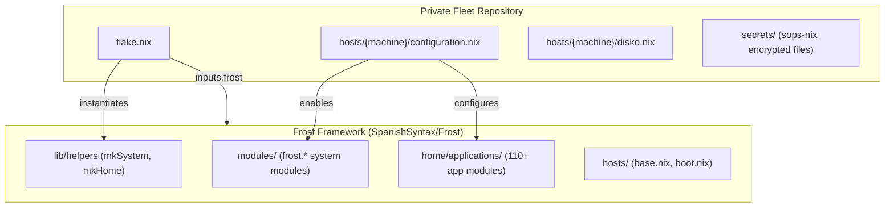
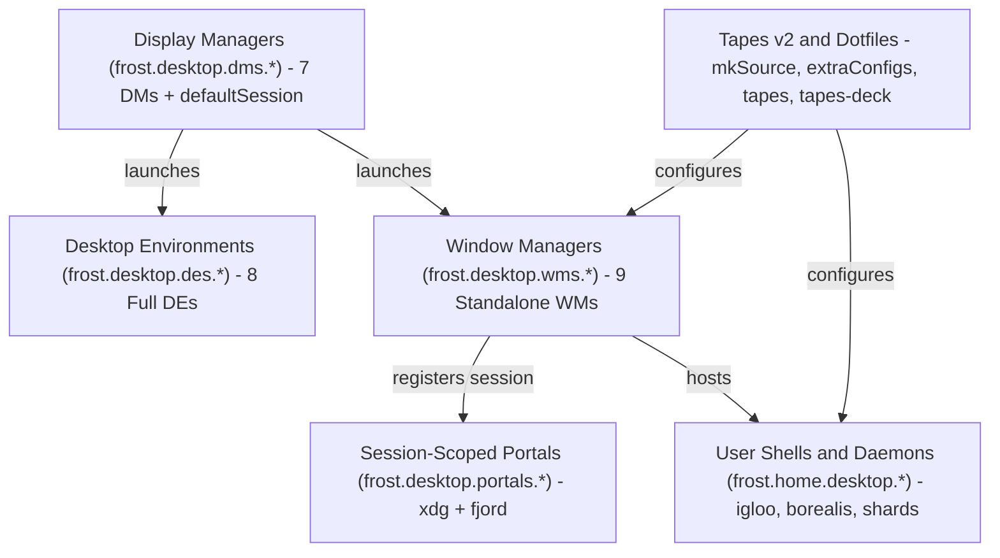
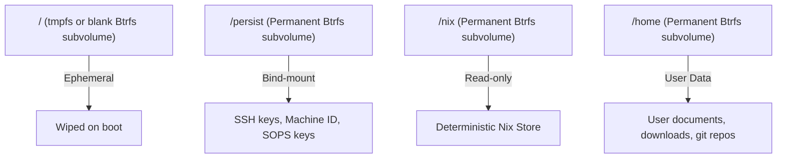

# Architecture & Foundations

Frost implements a modular architecture designed to decouple system and user environment definitions from hardware bindings and identity credentials.

---

## Why "Frost"? (The Lore)

> **frost** (`/frɔːst/`) — *noun:* The crystalline deposit of delicate ice needles that binds cold surfaces together, transforming raw terrain into a unified, resilient winter landscape.

In polar extremes, frost is not inert freezing—it is the crystalline glaze that seals porous stone, locks shifting gravel into permanent bedrock, and coats entire mountain ranges in a cohesive protective armor.

**Frost serves as the foundational glaze of the ecosystem:**
- **Bedrock Glaze**: A declarative, hermetic NixOS foundation that binds system services, desktop environments, and developer toolchains into a resilient whole.
- **Granular Crystallization**: Over 110 toggleable modules that crystallize only when enabled, leaving zero unneeded weight or runtime bloat behind.

---

## Flake & Fleet Separation

A core principle in Frost is separating reusable framework logic from fleet deployments:


```mermaid
graph TD
    subgraph Frost["Frost Framework (SpanishSyntax/Frost)"]
        Modules["modules/ (frost.* system modules)"]
        HomeApps["home/applications/ (110+ app modules)"]
        LibHelpers["lib/helpers (mkSystem, mkHome)"]
        BaseHosts["hosts/ (base.nix, boot.nix)"]
    end

    subgraph Fleet["Private Fleet Repository"]
        Flake["flake.nix"]
        PrivateHosts["hosts/{machine}/configuration.nix"]
        PrivateDisko["hosts/{machine}/disko.nix"]
        PrivateSecrets["secrets/ (sops-nix encrypted files)"]
    end

    Flake -->|inputs.frost| Frost
    PrivateHosts -->|enables| Modules
    PrivateHosts -->|configures| HomeApps
    Flake -->|instantiates| LibHelpers
```

1. **Upstream (Frost)**: Contains parameter-driven modules, application wrappers, out-of-store symlink logic, and base NixOS defaults.
2. **Downstream (Fleet)**: Contains hardware configurations, disk partitioning targets, user definitions, and SOPS-encrypted credentials.

---

## Directory Hierarchy

The repository is structured into distinct, non-overlapping domains:

```text
Frost/
├── flake.nix               # Flake inputs, library exports, and starter configurations
├── installer/              # Deployment & rescue tooling (frost-install, frost-recover)
│   ├── default.nix         # Derivations for installer tools
│   ├── install.sh          # Automated Disko partitioning & deployment script
│   └── recover.sh          # Auto-mounting rescue tool for Btrfs impermanence
├── lib/
│   └── helpers/            # Reusable builders (mkSystem, mkHome, recursive file scraper)
├── hosts/                  # Starter host configurations and base profiles
│   ├── base.nix            # Core Nix settings (GC, flakes, trusted-users)
│   ├── boot.nix            # standard systemd-boot loader configuration
│   ├── workstation/        # Starter graphical workstation profile
│   └── server/             # Starter headless server profile
├── modules/                # System-level 2-level modules (frost.* namespace)
│   ├── system/             # Boot (console, custom Plymouth builder), locale, runtime, storage
│   ├── hardware/           # PipeWire audio, peripherals, power, sensors (IIO, wluma ALS)
│   ├── network/            # Stack (firewall, networking), edge, remote, sync, VPNs
│   ├── security/           # Auth (PAM, Polkit, YubiKey) & secrets (SOPS, 1Password, keyring)
│   ├── desktop/            # 7 DMs, 8 DEs, 9 WMs, and session-scoped XDG portals
│   ├── virtualization/     # Containers (Docker, Podman, OCI), VMs (MicroVM, Libvirt), stacks
│   └── programs/           # Flatpak, gaming (Steam), system utilities
├── configs/                # Starter dotfiles & system configs
│   ├── home/               # Starter user configs (caelestia, nvim, sled, zsh.d, antigravity)
│   └── system/             # Starter system configs (caddy)
└── home/                   # User-level Home Manager modules (frost.home.* namespace)
    ├── home.nix            # Central user module collector
    ├── applications/       # 110+ XDG-categorized app modules (ai, dev, gaming, graphics, ...)
    ├── desktop/            # Wayland shells (igloo) & desktop tools (borealis, shards, igloo_cli)
    ├── environment/        # configsPath / extraConfigs / mkSource, fonts, GTK, XDG, ignores
    ├── services/           # User services (syncthing, google_drive)
    └── users/              # User profiles
        └── frost.nix       # Generic starter user environment
```

---

## Decoupled Desktop Stack (DMs, DEs, WMs, Portals, & Shells)

Frost enforces strict separation across the graphical desktop stack so any combination of Display Managers, full Desktop Environments, standalone Window Managers, and custom Wayland shells can be co-installed on the same host without conflict:


```mermaid
graph TD
    DM["Display Managers (frost.desktop.dms.*) - 7 DMs + defaultSession"]
    DE["Desktop Environments (frost.desktop.des.*) - 8 Full DEs"]
    WM["Window Managers (frost.desktop.wms.*) - 9 Standalone WMs"]
    Portals["Session-Scoped Portals (frost.desktop.portals.*) - xdg + fjord"]
    Shells["User Shells and Daemons (frost.home.desktop.*) - igloo, borealis, shards"]
    Tapes["Tapes v2 and Dotfiles - mkSource, extraConfigs, tapes, tapes-deck"]

    DM -->|launches| DE
    DM -->|launches| WM
    WM -->|registers session| Portals
    WM -->|hosts| Shells
    Tapes -->|configures| Shells
    Tapes -->|configures| WM
```

1. **Display Managers (`frost.desktop.dms.*`)**: Display managers never force-enable a coupled DE or WM. `frost.desktop.dms.defaultSession` provides a single point of truth for the default login session across all 7 DMs.
2. **Desktop Environments (`frost.desktop.des.*`)**: Full DEs (GNOME, Plasma, COSMIC, XFCE, etc.) remain isolated from standalone WM overrides.
3. **Window Managers (`frost.desktop.wms.*`)**: All 9 WMs (`hyprland`, `niri`, `sway`, `river`, `mango`, `i3`, `bspwm`, `awesome`, `qtile`) guard their user services (Polkit authentication agents, IIO screen rotation daemons) with compositor-specific `ConditionEnvironment` checks (`HYPRLAND_INSTANCE_SIGNATURE`, `NIRI_SOCKET`, `SWAYSOCK`, `XDG_CURRENT_DESKTOP=mango`, `XDG_CURRENT_DESKTOP=river`).
4. **Session-Scoped Portals (`frost.desktop.portals.*`)**: Instead of emitting a global `xdg.portal.config.common` that hijacks GNOME or KDE file choosers, `frost.desktop.portals.xdg` emits per-compositor `<session>-portals.conf` rules (`portalOrder ++ ["gtk"] ++ fallbacks`) only for registered WMs.
5. **Shells & Daemons (`frost.home.desktop.*`)**: `frost.home.desktop.shells.igloo` scopes its Wayland toolkit environment exports to `~/.config/uwsm/env-${cfg.compositor}` and exposes independent `manageConfig` and `systemd.enable` toggles matching `borealis` and `shards`.

---

## Ephemeral Storage & Disko Partitioning

Frost treats root filesystems as ephemeral state. By leveraging [Disko](https://github.com/nix-community/disko) and Btrfs snapshots (or tmpfs-on-root via Impermanence), the root subvolume is wiped on every boot:


```mermaid
graph TD
    Root["/ (tmpfs or blank Btrfs subvolume)"] -->|Ephemeral| Discard["Wiped on boot"]
    Persist["/persist (Permanent Btrfs subvolume)"] -->|Bind-mount| State["SSH keys, Machine ID, SOPS keys"]
    NixStore["/nix (Permanent Btrfs subvolume)"] -->|Read-only| Store["Deterministic Nix Store"]
    Home["/home (Permanent Btrfs subvolume)"] -->|User Data| Data["User documents, downloads, git repos"]
```

### Subvolume Layout

In `hosts/workstation/disko.nix`, the storage layout is partitioned into:

- `@` — Ephemeral root, snapshotted or reset on boot.
- `@nix` — Persistent Nix store.
- `@persist` — Critical system state (`/etc/machine-id`, `/etc/ssh`, `/etc/sops`).
- `@home` — Persistent user home directories.
- `@boot` — ESP partition for systemd-boot.

---

## Out-of-Store Symlinking & Tapes v2

Iterating on Wayland configurations or desktop dotfiles traditionally requires a `nixos-rebuild switch`. Frost provides centralized path resolution via `frost.home.environment.configsPath` and `mkSource`:

```nix
frost.home.environment = {
  # String path -> mutable out-of-store symlinks (live hot-reloading)
  configsPath = "${config.home.homeDirectory}/Fleet/configs/home";

  # Extra WM/app config directories under configsPath linked into ~/.config/<name>
  extraConfigs = ["hypr" "mango" "niri"];

  # Nix path literal -> immutable in-store copy (pure server builds)
  # configsPath = ../configs/home;
  # mutable = false;
};
```

- When `configsPath` is a string and `mutable = true`, `mkSource` delegates to `config.lib.file.mkOutOfStoreSymlink`, so edits take effect immediately on save without invoking `nixos-rebuild`.
- When `configsPath` is `null`, Frost falls back to its built-in starter templates in `configs/home/`.
- `extraConfigs` links any additional subdirectories from `configsPath` (such as `hypr/`, `mango/`, `niri/`, `waybar/`) directly into `~/.config/<name>` via `mkSource`.
- For hot-swappable desktop/WM rices, Frost integrates **Tapes v2** (`frost.home.apps.settings.desktop.tapes`), including the **Tapes-Deck** Slint GUI (`gui.enable = true`) and declarative **Featured Tapes** (`featured = ["caelestia" "end-4" "nebula" "noctalia-libre" "serpantinum"]`), allowing users to materialize and atomically swap `~/.config` rices without disturbing Home Manager-owned tool configs (`sled/`, `nvim/`, `zsh.d/`).
